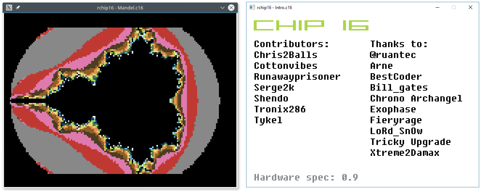

rchip16
=======

A [chip16][1] emulator written in [Rust][2].

Status
------

Specification 1.3 has been fully implemented.
Additionally, the emulator supports basic debugging functionality.
The emulator has been tested under Linux and Windows 10 but should also work under OSX.
Roms can be found either on the [forum][3] or [here][4].
Sound and timing accuracy are not perfect but what I would describe as *good enough*
with audio sounding best at a sample rate of 48 kHz or higher.

Usage
-----

```
cargo run --release -- ROM [FLAGS]
```

The emulator runs at a frequency of 1MHz,
you can remove that limitation by specifying the flag `--unlimited` at launch.

Controller layout
-----------------

|        | Player 1      | Player 2     |
|:-------|--------------:|-------------:|
| Up     | `Up`          | `W`          |
| Down   | `Down`        | `S`          |
| Left   | `Left`        | `A`          |
| Right  | `Right`       | `D`          |
| A      | `N`           | `X`          |
| B      | `M`           | `C`          |
| Select | `Right Shift` | `Left Shift` |
| Start  | `Enter`       | `Tab`        |

Debugging
---------

The debugger can be entered by either pressing `F12` or specifying the flag `--break` at launch.

| Command     | Description                                        |
|:------------|:---------------------------------------------------|
| `bc PC`     | break once the program counter hits `PC`           |
| `bo OPCODE` | break before opcode `OPCODE` is executed           |
| `s`         | perform one cpu step                               |
| `c`         | exit the debugger and continue running the program |
| `q`         | quit the program                                   |

Screenshots
-----------



[1]: https://github.com/chip16/chip16
[2]: https://www.rust-lang.org
[3]: http://ngemu.com/threads/chip16-official-thread-development-suggestions.145620/
[4]: https://drive.google.com/file/d/1cRFjvExxWZ7zYyw7OikG0wfC5OqulQOd
